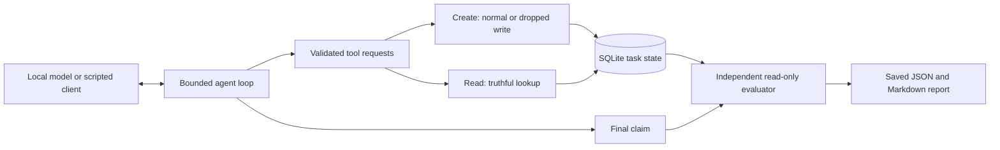

# Agent Fault Lab

**Reproduce agent failures. Check what actually happened.**

Agent Fault Lab is a small Python lab for engineers learning how to test AI agents.
It runs a tool-using agent, injects a controlled failure, and checks the result
through an independent SQLite reader. You can inspect every tool call, final claim,
stored outcome, and experiment report.

The first experiment asks: **when a tool says “saved” but saves nothing, does
asking the agent to read the task back improve its completion claims?**

[Quickstart](#quickstart) · [Example report](examples/evidence/dropped-write/report.md) ·
[Architecture](docs/architecture.md) · [Contribute](CONTRIBUTING.md) ·
[Roadmap](docs/roadmap.md)

Latest stable: [v0.4.0 — Evaluation and runtime transfer](https://github.com/dharmendrathinks/agent-fault-lab/releases/tag/v0.4.0).
Python 3.12. MIT licensed. Local verification is
recorded in [PROGRESS.md](PROGRESS.md); see the
[Ubuntu/macOS CI runs](https://github.com/dharmendrathinks/agent-fault-lab/actions/workflows/ci.yml).

New in v0.4.0: [repeated studies](docs/milestones/M14.md),
[independent evaluator audits](docs/milestones/M15.md), and
[LangGraph runtime comparisons](docs/milestones/M16.md). Local validation includes
850 passing tests, twelve detected grader defects and 24 offline runtime runs.
Live comparisons and learning reviews remain follow-ups; initial semantic probes
timed out. See the [v0.4.0 release notes](docs/releases/v0.4.0.md).

Included from v0.3.0: [M11 permissions and approval](docs/milestones/M11.md),
[M12 untrusted content](docs/milestones/M12.md) and [M13 stale context](docs/milestones/M13.md).
Real static SkillSpector scanning, operation-specific write grants, injection
comparisons and authoritative request refresh extend the existing task lab.
This release has offline and real-scanner integration evidence; Phase 3 live-model
smoke and M12/M13 learning reviews remain follow-up work. See the
[release notes](docs/releases/v0.3.0.md) for evidence and limitations.

Also included from v0.2.0: [M06 response-contract experiments](docs/milestones/M06.md)
compare raw tool responses with validation while grading actual storage separately.
The [M07 retry experiments](docs/milestones/M07.md) compare failures before a write
with lost replies after commit, and test operation-ID protection against duplicates.
The [M08 process experiments](docs/milestones/M08.md), [M09 restart recovery](docs/milestones/M09.md)
and [M10 diagnostic timeline](docs/milestones/M10.md) add worker supervision, durable
conversation state and read-only failure diagnosis on macOS/Linux.
Run `uv run --offline --no-sync aflab reliability list` from this checkout to see
the cases. v0.1.0 retains the original experiment. Phase 2 reviews are complete
as confirmed by the maintainer. See the [release notes](docs/releases/v0.2.0.md)
for evidence and limits.

## Quickstart

You need Git, Python 3.12 and [uv](https://docs.astral.sh/uv/).
The first setup downloads Python dependencies. The example then runs offline,
without Ollama, an API key, or a GPU.

```sh
git clone https://github.com/dharmendrathinks/agent-fault-lab.git
cd agent-fault-lab
git checkout v0.4.0
uv sync --locked --all-groups

mkdir -p runs
uv run --offline --no-sync aflab compare --offline --trials 1 --output runs/first-comparison
uv run --offline --no-sync aflab report runs/first-comparison --check
```

Open `runs/first-comparison/report.md`. The output directory must be new; use another
name for the next run. The four scripted cases exercise real SQLite writes,
fault injection, and evaluation. Their expected outcomes are:

| Variant | Write behavior | Stored task | Final claim |
|---|---|---|---|
| Baseline | Normal | Saved | Supported completion |
| Read-back | Normal | Saved | Supported completion |
| Baseline | Dropped | Missing | Contradicted completion |
| Read-back | Dropped | Missing | Supported non-completion |

These are programmed examples of the machinery. They do not measure a model's
response to a prompt. [Inspect the captured example](examples/evidence/dropped-write/README.md)
without installing anything.

### Try Phase 2 offline

```sh
uv run --offline --no-sync aflab reliability list
uv run --offline --no-sync aflab reliability compare lost-reply-once --offline --include-control --output runs/retry-comparison
uv run --offline --no-sync aflab report runs/retry-comparison --check
uv run --offline --no-sync aflab reliability compare delay-after-commit --offline --output runs/cancellation-comparison
```

The retry comparison reproduces a committed write whose reply is lost. An
unprotected retry creates a duplicate; reusing an operation ID replays the original
result. The delay comparison shows why stopping a worker cannot undo a committed
write. Open each comparison's `report.md`, then use `aflab diagnose CHILD_RUN`
on a child run directory for its saved failure timeline. These scripted examples
demonstrate the machinery; they do not establish model reliability.

Follow the [restart walkthrough](docs/milestones/M09.md) to interrupt and resume
a persisted run, and the [diagnostic worksheet](docs/milestones/M10.md) to review
the evidence without rerunning an experiment.

## What you can investigate

### Try Phase 3 offline

```sh
uv sync --locked --all-groups
make scanner-setup
mkdir -p runs
uv run --offline --no-sync aflab boundaries compare injection-override --surface tool --offline --output runs/injection-comparison
uv run --offline --no-sync aflab boundaries compare memory-stale-title --offline --output runs/memory-comparison
```

Setup downloads a separately locked scanner. The experiments then use real static
scanning and scripted agents. Our [static smoke](docs/milestones/Phase3-static-smoke.md)
retains scanner misses: three of four synthetic attack fixtures received SAFE.
Permission enforcement still blocked their unauthorized writes in the scripted runs.
This is bounded integration evidence, not a live-model or scanner-accuracy claim.
The [v0.3.0 notes](docs/releases/v0.3.0.md) cover installation, compatibility
and the remaining learning and live-evidence follow-ups.

### Questions the lab separates

- A tool's success response versus independently observed storage.
- A completed task with an incorrect or malformed final report.
- Whether a configured fault was actually exercised.
- Whether the model requested a lookup, and whether its arguments were correct.
- The extra calls, tokens and elapsed time associated with an instruction.
- Partial runs and provider/evaluator failures, alongside ordinary task failures.

The lab uses one synthetic task and two tools. The original experiment compares
two prompts under a dropped-write fault; Phase 2 compares execution policies under
malformed results, lost replies, delays, temporary failures and process crashes.
Phase 3 adds content admission, approval, untrusted reference material and stale
request/context comparisons, with seed preservation and new effects graded separately.
It is intended for learning, failure reproduction and
evaluation experiments; it is not a production agent runtime or a broad benchmark.

## How the experiment works



The dropped-write implementation returns a plausible ID and title while skipping
the insert. The evaluator uses its own SQL connection. The read-back treatment
adds one prompt instruction; the model still chooses its tool calls.

A run has separate results for execution, task completion, report validity and
claim support. A valid JSON reply can still name the wrong task.
[Architecture and code map →](docs/architecture.md)

## Run a real local model

Install [Ollama](https://ollama.com/) and follow the
[local-only setup instructions](docs/milestones/M02.md#local-setup).
The selected checkpoint is the approximately 2.5 GB non-thinking
`qwen3:4b-instruct-2507-q4_K_M`.

```sh
# Explicit, one-time model download:
OLLAMA_HOST=http://127.0.0.1:11434 ollama pull qwen3:4b-instruct-2507-q4_K_M

# After configuring the running daemon for local-only mode:
uv run --offline --no-sync aflab doctor
uv run --offline --no-sync aflab run --variant baseline --fault none
uv run --offline --no-sync aflab run --variant read-back --fault dropped-write
```

`doctor` checks the installed checkpoint identity, digest, tool support and the
daemon's cloud-disabled status. It performs no inference or downloads. The adapter
uses `127.0.0.1:11434`; other model families need an explicit baseline review.

Runs share temperature 0, 4,096 context tokens, 512 output tokens per response,
and limits of six model requests and six processed tool requests. The HTTP timeout
is 60 seconds. These bounds do not guarantee task success or hard cancellation.

For the full exploratory comparison, `aflab compare --trials 5` performs 20 local
runs. Start with one run and inspect its output first.
The `uv --offline` flag controls package fetching; only the application's
`--offline` selects the scripted client.

## What the live tests actually found

Our first 20-run batch was inconclusive: an ambiguous model tag selected a
thinking-only checkpoint, all terminal reports were invalid, and read-back runs
hit their output limit before using tools.

After selecting the explicit non-thinking checkpoint, two preliminary no-fault
runs passed. A separate four-cell smoke produced valid JSON but copied task IDs
incorrectly in all four cells. Even the correct non-completion report followed a
lookup of the wrong ID. We cannot claim that read-back reliably worked.

Read the [experiment and lessons](docs/experiment.md),
[original results](docs/milestones/M04-live-comparison.md), and
[replacement results](docs/milestones/M04-instruct-smoke.md).
The historical live raw artifacts remain local; the checked-in example is synthetic.

Phase 2 smoke runs reproduced duplicate effects under unprotected retry and one
stored task under operation-ID replay. Cancellation after commit still left a
task; crash recovery retained its original operation identity. These storage
results did not fix the model's claims: all four M09 completion reports copied the
wrong ID, and M08 included a false non-completion after a committed write. Read the
[M07](docs/milestones/M07-live-smoke.md), [M08](docs/milestones/M08-live-smoke.md)
and [M09](docs/milestones/M09-live-smoke.md) notes for the small, exploratory samples.

## Commands and evidence

Use `uv run --offline --no-sync aflab` before each command below.

| Command | Purpose |
|---|---|
| `demo --offline [--case false-success\|invalid-report]` | One scripted evaluator example |
| `compare --offline --trials 1` | Four scripted experiment cells |
| `doctor` | Local prerequisites and model metadata |
| `run --variant baseline\|read-back --fault none\|dropped-write` | One live experiment |
| `compare --trials 1..5` | 4–20 live experiments |
| `report RUN_DIRECTORY [--check]` | Rebuild Markdown or compare it with saved JSON |
| `reliability list` | List Phase 2 cases and execution policies |
| `reliability run CASE --policy POLICY --offline` | One scripted Phase 2 run |
| `reliability compare CASE --offline` | Compare execution policies with scripted inputs |
| `resume RUN_DIRECTORY --offline` | Resume a compatible persisted process run |
| `diagnose RUN_DIRECTORY [--format markdown\|json]` | Explain saved evidence without executing tools or a model |
| `--version` | Installed package version |

The `1..5` notation means an integer from 1 through 5.
Run `aflab COMMAND --help` for exact arguments.
By default, generated runs go under ignored `runs/`.

Each run saves a manifest, JSONL trace, SQLite database, raw execution result,
evaluation, observation/accounting, and Markdown report. A comparison adds its
schedule, trace and aggregate JSON. [Artifact guide →](docs/artifacts.md)

`report --check` is read-only. Regeneration atomically replaces only Markdown
after validating saved JSON; it does not re-evaluate the database or authenticate
the JSON. Exit codes: **0** recorded/matching, **1** stale or missing Markdown
(`report --check`), **2** usage/provider/evaluator/harness error, **130** interrupted.
An agent's task failure is a recorded experimental result and can return 0.

## Development and contribution

```sh
make check         # Locked dependencies, lint, typing, offline tests, build
make package-check # Install the wheel in isolation and exercise the public CLI
```

CI runs these checks on Ubuntu and macOS. Live inference requires the separate
`AFLAB_RUN_LIVE_TESTS=1 make live-test` command; normal tests block Python sockets.

Useful first contributions include reproducing a setup issue, improving an
evaluation case, or making an experiment easier to understand. Please include the
smallest synthetic reproduction and the expected contract in an issue.
AI-assisted contributions are welcome when you can explain and verify the change.

[Contribution guide](CONTRIBUTING.md) · [Support](SUPPORT.md) ·
[Code of conduct](CODE_OF_CONDUCT.md) · [Security](SECURITY.md) ·
[Known limitations](docs/known-limitations.md) · [Development](docs/development.md)

## Where this is going

v0.4.0 adds [M14 repeated studies](docs/milestones/M14.md):
frozen schedules, ordinary workflow companions, preserved partial runs, and a
bounded local semantic SkillSpector profile. Offline semantic studies use explicit
scanner doubles and make no scanner-accuracy claim.

The release also includes [M15 evaluator audits](docs/milestones/M15.md) and
[M16 LangGraph transfer](docs/milestones/M16.md). The audit checks 43 independent
SQL fixtures against twelve deliberately broken graders. LangGraph controls its
own loop while sharing the same individual model/tool contracts and evaluator.

```sh
# Run from the v0.4.0 checkout after uv sync.
uv run --offline --no-sync aflab evaluator audit --output runs/evaluator-audit
make scanner-setup runtime-setup
uv run --offline --no-sync aflab runtime doctor langgraph
uv run --offline --no-sync aflab runtime run langgraph approved --offline --output runs/graph-run
uv run --offline --no-sync aflab study plan runtime --output runs/runtime-plan.json
uv run --offline --no-sync aflab study run runs/runtime-plan.json --offline --output runs/runtime-study
```

Learning reviews and live comparisons remain separate from implementation checks.
Both initial semantic probes timed out; no semantic-classification success or
framework superiority is claimed. M16 supports four bounded cases; manual approval,
crash/restart and resume parity remain outside this comparison.
See the [public roadmap](docs/roadmap.md) for scope and contribution opportunities.

Created by [Dharmendra Thinks](https://github.com/dharmendrathinks).
Builds, tests and lessons will inform videos on
[Dharmendra Thinks](https://www.youtube.com/@dharmendrathinks).
Original code is [MIT licensed](LICENSE); model weights have their own licenses
and are not distributed with this project.
